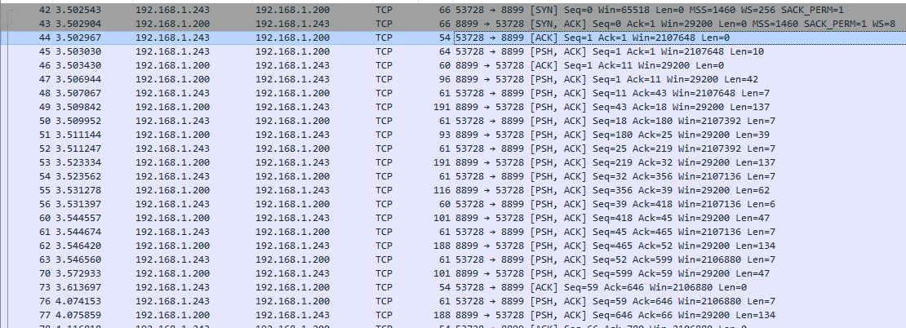
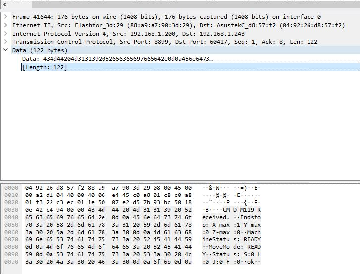
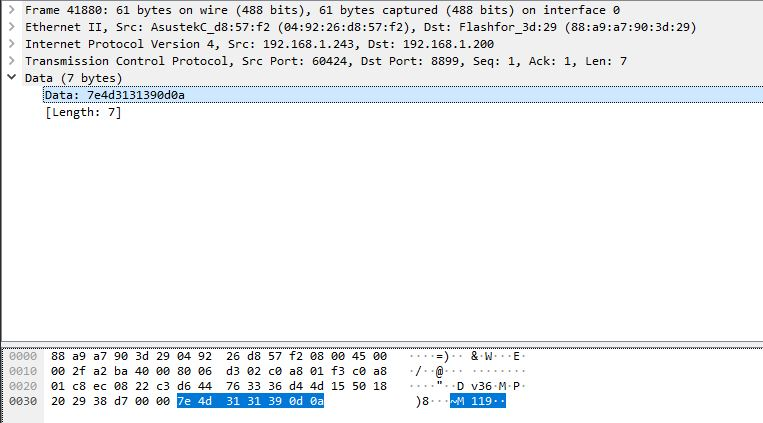

# Monoprice Voxel Smart Light

The goal of this project is to turn a light on in the closet where my [Monoprice Voxel](https://www.monoprice.com/product?p_id=33820) is located when the printer is running. I did this using a [Teckin Smart Plug](https://www.amazon.com/gp/product/B07FQJ8KC4/ref=ppx_yo_dt_b_asin_title_o01_s00?ie=UTF8&psc=1), [IFTTT Webhooks](https://ifttt.com/maker_webhooks), a little bit of python, and a raspberry pi to run it.

## Basics

My specific configuration doesn't have to match yours, as IFTTT is fairly well connected any compatible smart outlet, strip, bulb, or anything else would work. You could also use a relay and a normal bulb with a raspberry pi. 

## The Code

[printer_communications.py](printer_communications.py) -  This is where the infinite loop of pinging the printer to get the state, comparing this to the old state, and calling the webhooks request is executed. This is written for python 3.

The code is run as follows

    python printer_communications.py HOST_IP_ADDRESS HOST_PORT_NUMBER

[json_dict_webhook_writer.py](json_dict_webhook_writer.py) - A little script to put my specific webhooks into a json file that I can .gitignore in order to hide it from you.

## Webhooks
Before you start you will have to do the following.
1. Have an IFTTT account
2. Set up whatever compatible smart device you want to control
3. Enable whatever service you will be using with it on IFTTT (Smart Home for me, maybe Phillips Hue, etc for you)

Then follow the instructions below loosely based on this [article](https://techbyteswithronnutter.com/how-to-setup-streamdeck-and-phillips-hue/):

    1. Login to ifttt.com
    2. Navigate to https://ifttt.com/create
    3. Click on +This
    4. Search for Webhooks
    5. Click on Webhooks
    6. Click on Receive a web request
    7. Enter a name (remember this for later)
    8. Click on Create Trigger
    9. Click on +that
    10. Search for the service you are using
    11. Click on that service
    12. Click on the action you'd like to execute
    13. Click on Create Action
    14. Open a tab in browser to https://ifttt.com/maker_webhooks
    15. Click on Documentation
    16. Enter name of the applet you just created in the {event} field
    17. Click on the Test IT button at the bottom of the screen to confirm the settings
    18. Copy the https://maker.ifttt.com line at the bottom of the page

I had to do this twice for Smart Home, once to create a light on action, and once to create a light off action.

## The Printer

This code is very specific to my printer, and hasn't been tested against any other monoprice models or the FlashForge Adventurer 3 that it is a clone of, so your mileage may vary.

The main useful takeaway of this in the case you aren't using a voxel is my methodology of reverse engineering the communication between the 3D printer and it's connected desktop application.

No guarantees this will be as simple for you or will work at all! You will need a few things to start. 

1. Your 3D printers slicing/connected application installed.

2. On the same computer [wireshark](https://www.wireshark.org/) insatlled 

3. The local IP address of your computer and the local IP address of the 3D printer

To use wireshark you will need to first select the interface that your computer is conencting to your printer over, which is whichever is getting you on your local network. 

Then at the top of the screen you will need to add in a rule to filter the output to just the IP address of your printer. (In my case this is 192.168.1.200)

    ip.dst==192.168.1.200 or ip.src==192.168.1.200

Now that wireshark is set up, inside of your 3D printers slicing software connect to the printer and start a print. 

You will see wireshark populate with lines that look like this. Showing the communication between your printer and your computer. 

You can go through these communication line by line and read the hex and ASCII output of each exchange in the bottom half of the wireshark window. In these look for one where the ASCII output shows something about status, you will use be able to parse this message in python later to determine the state of the printer.

If you go up two more communications from the response with the information you want, you will ususally find the request that yielded it. This is because before the printer responds it first acknowledges the message you sent. You can see at the end of the message is the data of the command you want.

Copy this data by right clicking the hilighted data string as shown in the image above and selecting the "Copy as Hex Stream" option to get the data contigously. Once you have the exact hex of the request compied you can send that same request from your own program (like the one I used) and parse the response yourself in order to programatically get the state of the printer. You can look through other commands in wireshark to get more information like nozzle and print bed temperature, and percent completion of current print. The ones for the Monorpice voxel are below

## MP Voxel Commands

    Hex Command: What I think it is
    
    7e4d3630312053310d0a : Gain control of the printer, sent on connect.

    7e4d3131350d0a : Machine Type, Machine Name, Firmware, Serial Number, X, Y, Z, Extruder Count

    7e4d3635300d0a : X = 1.0 and Y = 0.5 (unsure of what this refers to)

    7e4d3131340d0a : X Position, Y Position, Z Position, A = 293 (?) B = 0 ?

    7e4d32370d0a :  SD Printing byte 1/100 ok(?)

    7e4d3131390d0a : X Max, Y Max, Z Max, Machine Status (Used in this program), Machine Movement, Status S (?), L (?), J (?), F (?)

    7e4d3130350d0a : Nozzle Temp/Target C, Bed Temp/Target C

    7e4d3630320d0a : Release control of the printer, sent on disconnect.